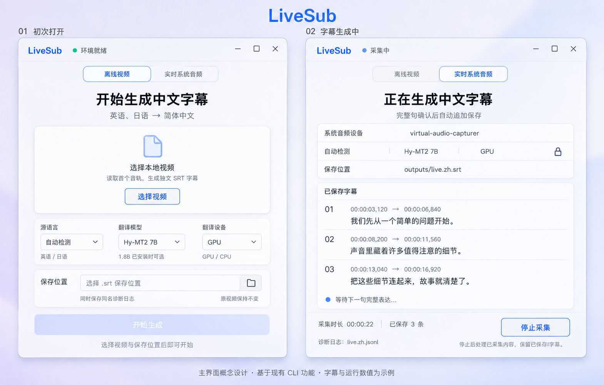
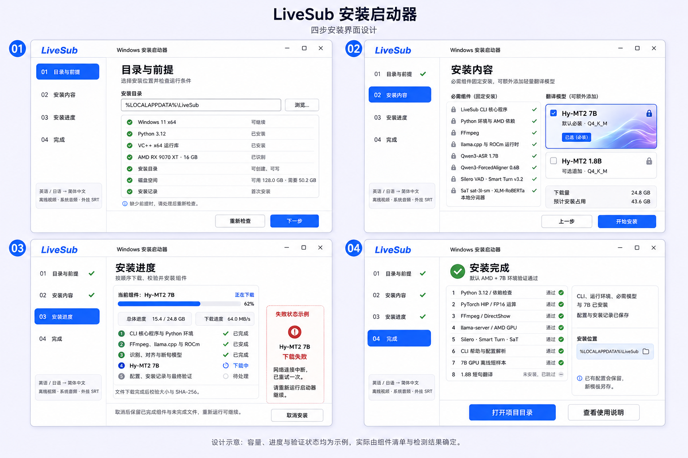

# LiveSub：Windows UI 开发执行文档（安装向导与字幕主界面）

> 文档版本：v3.0（双界面精简版）  
> 修订日期：2026-09-05  
> 目标项目：LiveSub；项目目录示例：`C:\Users\29279\LiveSub`  
> 目标环境：Windows 11 x64、AMD RX 9070 XT 16GB  
> 技术栈：C#、.NET 10、WPF；复用现有 Python CLI  
> 本版依据：用户确认的安装向导图、主界面图；图中数值和字幕均为设计示例。

## 0. 执行原则与范围变更

本版把交付范围明确为**四步安装向导 + 安装后的字幕主界面**，替代 v2.1 中“只做安装器、不做字幕操作界面”的限制。`01_Codex开发执行文档..md` 继续定义字幕处理链和公共 CLI；本文件定义其桌面操作层。不得把旧版“不做 GUI”的范围说明当作拒绝实现本版主界面的理由。

开始开发前读取实际源码、配置、锁文件和验证记录，记录与文档的差异。CLI 尚未完成时，可以先制作静态界面和小文件安装闭环；真实字幕联调等待对应 CLI 能力验证，完整发布仍以 CLI G3 通过为前提。本文不是已有实现或实机通过记录。

执行时坚持：

1. C# 负责界面、安装和一个任务的启动/停止；Python 复用原有处理链。不得在两端分别实现断句、识别、对齐或翻译。
2. 一个 WPF 窗口、两个普通界面区域、少量具体类即可。采用 code-behind、普通函数和必要的小数据类型。
3. 不引入 MVVM、依赖注入、通用 Host、事件总线、插件、任务图、数据库、Web 服务或 UI 组件库。
4. 只在文件、下载、解压、外部进程和模型调用等真实边界增加错误上下文，不层层包装异常。
5. 用少量共享样式实现设计图；优先保证文字可读、操作清楚、窗口响应正常。
6. 每阶段只验证本阶段变化；不因调整颜色、间距或文案重复下载模型、跑完整 GPU 测试。
7. 本任务只实施明确功能，不预留未来后端、账户系统、主题或自动更新框架。

## 1. 产品功能边界

| 界面 | 必须提供 |
|---|---|
| 安装向导 | 目录与前提检查、必需组件及默认 7B、可选追加 1.8B、顺序下载安装、取消续传、错误说明、安装后最小验证 |
| 离线视频 | 选择一个本地视频、读取首个音轨、选择源语言及翻译模型/设备、选择 SRT 路径、开始/停止、只读查看已保存字幕 |
| 实时系统音频 | 选择 DirectShow 音频设备、选择相同参数和输出路径、开始/停止采集、显示采集时长与已保存字幕 |
| 输出 | 固定简体中文外挂 `.srt` 和同名 `.jsonl`；原视频保持不变 |

固定处理链仍为 FFmpeg → Silero VAD → Smart Turn → Qwen3-ASR → SaT → ForcedAligner → Hy-MT2 → SRT/JSONL。ASR 和对齐器固定使用 AMD GPU；CPU/GPU 选择只影响 Hy-MT2 翻译。7B 为默认模型，1.8B 只有已安装时才能用于任务，二者沿用部署指南中的 Q4_K_M 文件；一次任务只加载一个 Hy-MT2，运行中不切换。

首版不做：播放器、字幕编辑、逐词临时结果、悬浮字幕、样式/字体设置、烧录视频、ASS、多音轨、说话人分离、多目标语言、批量任务、历史任务库、暂停恢复字幕任务、性能仪表盘、模型市场、NVIDIA、云 API、账户、自动更新或卸载器。安装器仍不自动安装系统、显卡驱动、Python、VC++ 或虚拟音频驱动。

## 2. 设计依据与统一规范

### 2.1 两张参考图

**字幕主界面：首次打开与生成中。**



**安装向导：四步流程及错误状态。**



图片用于确认信息层次、间距、配色和状态，不作为背景图直接铺进软件。图外的编号、标题、说明文字不是产品控件；“失败状态示例”仅表示另一种状态，不与正常下载同时显示。容量、速度、字幕、时长和验证状态必须来自实际运行，不得硬编码图中的示例值。

必需组件与默认 7B 可以显示锁定图标；安装前的可选 1.8B 必须可以勾选，不照搬图中可能造成误解的锁图标。

### 2.2 少量设计常量

| 项目 | 固定建议 |
|---|---|
| 背景与主色 | 浅灰紫 `#F4F4FC`；主色 `#3974FF`；卡片接近白色 |
| 文字 | 主文字 `#172033`；次文字 `#647084`；状态同时使用文字与小图标 |
| 字体 | 系统 `Microsoft YaHei UI` / `Segoe UI`，不下载或分发字体 |
| 字号 | 正文 14 DIP；辅助 12 DIP；分区标题 20 DIP；主标题 28 DIP |
| 间距 | 使用 8 / 16 / 24 DIP；窗口内容边距 24 DIP；卡片内边距 16 DIP |
| 控件 | 输入框和按钮高 36–40 DIP；控件圆角约 8 DIP，卡片约 12 DIP |
| 窗口 | 默认约 1040 × 760 DIP；最小约 900 × 640 DIP；使用系统窗口按钮 |
| 布局 | 安装步骤栏约 180 DIP；主界面无常驻侧栏；底部操作区稳定可见 |

将颜色、间距和必要控件样式放在一个小型资源字典中，不拆成主题系统。使用标准 Button、ComboBox、TextBox、ListBox、ProgressBar、文件选择/保存对话框和普通 Grid/Border。

“液态玻璃”只采用浅色渐变、半透明背景画刷、细亮边和少量柔和阴影。正文区接近不透明；不降低整个容器的 Opacity，以免文字一起变淡。首版不做实时背景模糊、折射着色器、鼠标跟随、循环动画或为视觉效果调用复杂 Win32 接口，不启用 `AllowsTransparency=True`。普通 WPF 样式达到图中的轻盈感即可。

在 100% 与 150% 缩放下检查主要页面；空间不足时内容区滚动，文字换行，保留底部主操作。保证 Tab 顺序、键盘焦点、禁用态和错误文字清楚，不用精确像素对比测试验收外观。

## 3. 应用入口与界面切换

同一套自包含 EXE 承担安装和日常运行，不维护两套界面工程：

1. 发布的安装 EXE 从下载目录运行时进入四步向导，默认安装根目录为 `%LOCALAPPDATA%\LiveSub`，允许用户更改。
2. 安装时把本版本 EXE 复制为 `<安装根目录>\LiveSub.exe`。不修改系统 PATH，不要求激活 `.venv`；源与目标相同时不复制。
3. 双击安装目录中的 `LiveSub.exe`，以 EXE 所在目录为根，根据同目录安装记录和必需文件判断是否进入字幕主界面；缺失项进入安装提示，保留原目录。
4. 安装成功页以“打开 LiveSub”为主操作，切换到同一窗口中的字幕主界面；“打开项目目录”“查看使用说明”保留为次级入口。这是连接两张图所需的操作，不新增第五个安装步骤。
5. 再次运行发布的安装 EXE，可在目录页选择原目录，跳过已完成组件并追加 1.8B。首版不另做维护或修复中心。
6. 不要求自动升级或覆盖正在运行的 EXE。发现不同版本或未知文件冲突时明确说明，由用户选择新目录；不能静默覆盖用户文件。

安装根目录一旦确定，后续工具、模型和配置路径均据此解析，不依赖开发机用户名、源码位置或启动时工作目录。主界面与安装任务互斥，不允许边生成字幕边修改运行环境。用一个包含产品名的命名互斥量限制本产品同时运行一个实例；不增加实例激活通信。

## 4. 安装向导

四步仍使用同一个界面中的四个普通 Grid，按需切换 Visibility，不引入页面导航框架。

| 步骤 | 内容与操作 |
|---|---|
| 01 目录与前提 | 安装目录及“浏览”；Windows 11 x64、目录可写、磁盘空间、Python 3.12 x64、VC++ x64、AMD RX 9070 XT、已有安装记录；“重新检查”“下一步” |
| 02 安装内容 | 必需项固定显示；默认勾选且不可取消的 Hy-MT2 7B；可选追加的 1.8B；总下载量和预计安装占用；“上一步”“开始安装” |
| 03 安装进度 | 当前组件、下载进度与速度、总下载进度、阶段状态、“取消安装”；失败时在同一处显示组件名、阶段、原因和下一步 |
| 04 完成 | 显示真实最小探针结果；未安装 1.8B 显示“未安装，已跳过”；提供第 3 节的三个完成入口 |

必需项可合并展示为：CLI 核心程序；Python 环境与 AMD 依赖；FFmpeg；llama.cpp 与 ROCm；Qwen3-ASR 1.7B；Qwen3-ForcedAligner 0.6B；Silero / Smart Turn；SaT / 本地 tokenizer。它们均不可取消，不把 ASR 1.7B 和翻译 7B 画成二选一。

安装进行中锁定目录、模型选择和返回操作。取消或关闭窗口时先取消下载/安装操作、回收其子进程，再退出；已完成组件保留，当前组件不记成功。失败后可重新运行向导续装，不增加独立错误页、暂停按钮或跳过必需组件按钮。

下载百分比仅表示实际下载字节进度；解压、依赖安装、校验和探针使用阶段文字，无法测量时用不定进度。不得在所有步骤未结束时显示“安装完成”。

## 5. 字幕主界面

### 5.1 共用布局与参数

窗口从上到下只有：产品及状态、两种模式切换、输入、必要参数、保存位置、只读字幕区/空状态、底部操作。没有常驻侧栏、设置页或复杂控制面板。

| 控件 | UI 选项 | CLI 对应 |
|---|---|---|
| 模式 | 离线视频 / 实时系统音频 | `offline` / `live` |
| 视频文件 | 单个本地视频 | `--input` |
| 系统音频设备 | 实际 DirectShow 设备名 | `--audio-device` |
| 源语言 | 自动检测 / 英语 / 日语 | `--source-lang auto/en/ja` |
| 翻译模型 | Hy-MT2 7B / 已安装的 1.8B | `--mt-model 7b/1.8b` |
| 翻译设备 | GPU / CPU | `--mt-device gpu/cpu` |
| 保存位置 | `.srt` 文件路径 | `--output` |

默认自动检测、7B、GPU；目标语言固定显示“简体中文”，不设下拉框。未安装 1.8B 时不允许选中它，可显示“1.8B 已安装时可选”。ASR/对齐器不暴露设备或模型切换。

首次显示空输入和保存位置提示，开始按钮禁用。选择视频后可建议 `<安装根目录>\outputs\<视频名>.zh.srt`；实时模式可建议带当前时间的文件名。用户可通过保存对话框更改。

只在输入和必需参数有效、所选模型存在、输出父目录可写时启用开始。SRT 或同名 JSONL 已存在时提示更换文件名，首版不提供覆盖或跨任务追加；CLI 文件创建也必须拒绝覆盖，防止检查后发生竞态。配置中的相对路径以 `config.toml` 所在目录为基准，显示路径可简写，传给进程的输入/输出使用绝对路径。

### 5.2 离线视频

- 选择视频区保持简洁，说明“读取首个音轨，生成独立 SRT 字幕”，不加入播放器、缩略图、拖拽批量导入或音轨选择。
- 点击“开始生成”后锁定模式、文件、语言、模型、设备和输出位置；按钮改为“停止生成”。
- 生成中展示已保存的完整字幕和条数。首版只显示实际阶段及活动指示，不为了百分比、总时长或预计结束时间额外引入媒体分析功能。
- 正常结束显示“生成完成”；主动停止显示“已停止，保留已保存字幕”，不能显示成整部视频处理完成。
- 没有可生成的语音时明确显示“未检测到可生成字幕的语音”；异常显示阶段和简短原因，保留已生成文件。
- 结束后恢复输入控件。开始下一次任务时清空本次界面预览和计数，不删除之前的输出文件，也不建立任务历史。

### 5.3 实时系统音频

- 进入模式时用项目 FFmpeg 枚举 DirectShow 音频设备；提供一个小的“刷新”操作用于设备安装后重查。不持续轮询设备。
- 展示并传递真实设备名；`virtual-audio-capturer` 只是示例，不能在没有设备时填成已连接。枚举信息只能证明设备存在，不能证明它正在捕获系统声音。
- 无音频设备时禁用“开始采集”，显示“未找到可用音频设备，请按部署指南配置回环设备后刷新”。设备有麦克风等普通输入时，应提示用户选择能采集系统播放声音的回环设备，不自动选择第一个设备。
- 点击“开始采集”后参数全部锁定，主操作改为“停止采集”；展示实际采集时长和已保存总条数。
- 采集时长来自采集样本计数，不混入模型加载、队列等待或界面刷新时间；实时采集不显示完成百分比或预计剩余时间。
- 收到后端对应状态时才显示“采集中”“等待下一句完整表达”等文字，不靠界面计时猜测模型状态。
- 点击停止后显示“正在处理已采集内容”，停止按钮禁用，等待后端排空和最后一次完整性判断。未确认完整的内容仍不生成字幕；结束状态应说明是否有未提交内容。
- `audio_queue_overrun`、发言超长、捕获中断或其他失败必须明确显示“字幕不完整”及根因，不自动改用轻量模型继续。

### 5.4 已保存字幕与状态

字幕列表只读，每条显示序号、SRT 时间范围、简体中文完整句；只有后端实际写入并刷新 SRT/诊断后才显示。UI 不生成、重排、编辑或修正字幕时间，不显示逐词结果。

界面仅保留最近 200 条预览，计数仍显示本任务已保存总条数，完整结果始终在 SRT 中；必要时显示“仅展示最近 200 条”。使用标准虚拟化列表，后台持续读消息，约每 200–300 ms 合并一次 UI 更新，结束时立即补齐。UI 刷新不能阻塞音频处理，不建立监控或多级队列框架。

安装探针通过的完成页可显示“环境就绪”。平时重开主界面只读安装状态并检查必要路径；尚未做本次验证时显示“已安装，待启动检查”，不每次加载所有模型，也不把旧记录写成当次 GPU 验证结果。

错误在当前内容区显示一句原因和可执行的下一步，诊断文件名用小字保留；不弹出多个重复对话框、不展示堆栈或把原文/译文另写入启动器日志。

## 6. 最小代码组织与发布设置

建议职责如下，文件名可随现有工程小幅调整，不以文件数量作为目标：

| 文件/类 | 唯一职责 |
|---|---|
| `MainWindow.xaml(.cs)` | 窗口外壳、安装根目录、安装/字幕两个界面的切换 |
| `SetupView.xaml(.cs)` | 四步安装布局、按钮事件和页面状态 |
| `SubtitleView.xaml(.cs)` | 两种模式、参数、只读字幕和任务状态 |
| `UiStyles.xaml` | 少量颜色、字号、间距和控件样式 |
| `SetupCoordinator` | 固定安装顺序与取消 |
| `DownloadService`、`Installer`、`ProbeRunner` | 下载；提交文件/环境/状态；最小探针 |
| `TaskRunner` | 一个字幕子进程、消息读取、停止与释放 |
| `subtitle_cli/ui_bridge.py` | 复用 CLI，提供本 UI 所需的极小进程通信适配 |

两个 View 是普通 UserControl，不开发可复用控件库；只用一个小枚举表示安装步骤，另用必要的布尔值或小枚举表示任务是否启动/运行/结束。不要把每个画面状态拆成类、每个操作拆成 Command 或为单一实现创建接口。

网络、文件、哈希和进程等待采用异步调用；解压等耗时同步工作放到后台执行。只通过 Dispatcher 或 `IProgress<T>` 回到 UI 更新控件，不在 UI 线程 `.Wait()` / `.Result`。普通共享帮助函数直接放在使用它的类中。

工程继续放在 `launcher\`，保留 `Resources\components.json`、CLI 核心包构建脚本和一个测试项目。自包含发布保留以下关键设置：

```xml
<PropertyGroup>
  <OutputType>WinExe</OutputType>
  <TargetFramework>net10.0-windows</TargetFramework>
  <UseWPF>true</UseWPF>
  <Nullable>enable</Nullable>
  <RuntimeIdentifier>win-x64</RuntimeIdentifier>
  <SelfContained>true</SelfContained>
  <PublishSingleFile>true</PublishSingleFile>
  <IncludeNativeLibrariesForSelfExtract>true</IncludeNativeLibrariesForSelfExtract>
  <PublishTrimmed>false</PublishTrimmed>
  <PublishReadyToRun>false</PublishReadyToRun>
</PropertyGroup>
```

不使用预览语言特性、AOT、混淆或额外打包框架。

## 7. UI 与 CLI 的小型连接契约

### 7.1 调用方式

保留 `subtitle-cli` 公共参数不变。在 Python 包内新增一个很薄的 `ui_bridge.py`，复用同一参数解析、处理函数、停止信号和资源清理路径；仅增加必要的进度/字幕通知出口。不得把业务链复制到桥接文件，也不扩展为插件后端或服务 API。

WPF 直接启动 `<安装根目录>\.venv\Scripts\python.exe`，参数为 `-u -m subtitle_cli.ui_bridge`，其后传入表 5.1 对应的同一组命令参数。工作目录固定为安装根目录；CLI/桥接入口从这里找到 `config.toml`。Python 核心包必须真正安装进 `.venv`，不能只复制 `src` 后假定模块可导入。

使用 `ProcessStartInfo.ArgumentList` 逐项传参；设置 `UseShellExecute=false`、`CreateNoWindow=true`，重定向 stdin/stdout/stderr，并统一 UTF-8。stdout 和 stderr 分别持续异步读取，不拼接 shell 命令。[ArgumentList 官方说明](https://learn.microsoft.com/en-us/dotnet/api/system.diagnostics.processstartinfo.argumentlist?view=net-10.0)

Python 负责自己创建的 FFmpeg 和 llama-server。ROCm 运行时目录只注入 llama-server 子进程 PATH，包含已验证所需的 `bin` / `lib\llvm\bin`；不得污染 WPF、Python 或系统 PATH。

### 7.2 三种消息足够

stdout 只输出逐行 UTF-8 JSON，完整一行后刷新。普通日志、库输出和子进程日志走 stderr；现有诊断 JSONL 继续是文件，不用解析它或人类日志来驱动 UI。

| `type` | 最小字段及含义 |
|---|---|
| `status` | `stage`、可选 `captured_seconds`；仅在真实阶段变化/采集进度更新时发送，时长最多每秒一次 |
| `subtitle` | `index`、`start_ms`、`end_ms`、`text`；SRT/诊断写入成功后按序发送 |
| `finished` | `result`、`message`，失败时附 `stage`；只在任务和子进程收尾后发送一次 |

`finished.result` 只需 `completed`、`stopped`、`incomplete`、`failed`。分别表示正常完成、用户停止且没有额外失败、存在未提交/缺失内容、执行失败。UI 根据结果显示文案；非零进程退出、通信错误或未收到结束消息都不能显示“生成完成”。公共 CLI 的错误语义继续遵守文档 01。

消息是同版本 UI 与 CLI 的私有契约，只在 `launcher\docs\cli-contract.md` 记录字段、实际阶段名和示例。不引入远程 schema、版本协商、通用事件分发器或兼容多个 CLI 版本的框架。

### 7.3 停止与回收

WPF 向 stdin 写入一行 `{"command":"stop"}` 并刷新；重复点击不重复发任务。桥接层用一个轻量读线程接收请求并触发现有停止信号；stdin 关闭也视为停止，不能靠模拟键盘 Ctrl+C 或直接杀进程实现正常停止。

实时模式先停止生产音频，再处理已入队数据及残余音频；离线模式停止继续读取并在可安全结束的位置收尾。停止期间已写出的字幕保持不变，未完成表达不能强行写出。

停止和关闭窗口共用这一条路径，界面保持响应。请求停止后最多等待 60 秒；超过等待上限才强制回收本任务进程树，并明确记录“结束超时，字幕不完整”。这是退出保护，不是音频切句时长或正常任务时限。

进程回收集中放在 TaskRunner/Python 的实际资源边界。需要保证异常退出时一并清理后代进程时，可增加一个小型 Windows Job Object 生命周期帮助类，不扩展成进程编排器。不能只依据 Python 的退出认定所有子进程已退出；强制退出不能标记为正常完成。[进程终止与后代进程说明](https://learn.microsoft.com/en-us/dotnet/api/system.diagnostics.process.kill?view=net-10.0)

## 8. 安装实现：固定清单、顺序执行

### 8.1 清单与核心包

`components.json` 随 EXE 发布且只读，组件数组顺序就是安装顺序，不设依赖图、远程动作或可执行脚本字段。为表达部署指南中的双归档 ROCm，采用以下小结构：

- 根字段：`baseDownloadSizeBytes`、`baseInstalledSizeBytes`、`basePeakExtraBytes`、`components`。
- 每组件：`id`、`name`、`target`、`requiredPaths`、`installedSizeBytes`、`optional`、`sources`。
- 每下载源：`url`、`downloadSizeBytes`、`sha256`、`archive`、`stripComponents`。
- `archive` 仅为 `none`、`zip`、`tar.gz`；`stripComponents` 只允许 0 或 1，固定值在确认上游归档结构后填写。
- 普通组件只有一个 source。裸文件的 target 是最终文件；归档组件的 target 是最终目录。
- ROCm multiarch 与 gfx120X 两个归档属于同一个组件、同一个 staging，按已核对顺序解包并剥离顶层目录，合并校验后一次提交。允许已核对的归档在本组件 staging 内按顺序合并，不允许覆盖其他组件或用户文件。

正式清单必须填写固定 HTTPS URL、精确下载字节数、合并后安装字节数、SHA-256 和少量关键路径；不得保留占位值。target 和 requiredPaths 均为相对路径，规范化后必须仍在安装根目录内。不同组件 ID 和最终目标不得冲突，同一个文件不能归属多个组件；本组件的 target 可以同时列入自己的 requiredPaths。

CLI 核心包通过明确允许列表构建并内嵌，只包含源码及桥接文件、项目元数据、AMD 锁文件、配置模板、README、通知文件和极短合法测试样本。模型、`.venv`、运行时、输出和私人媒体不嵌入。

基础下载量包含锁定 Python/AMD 依赖；基础安装占用包含 CLI、完整 `.venv` 和安装目录中的 LiveSub.exe。构建时按真实版本组合记录，不能用模型下载量冒充总下载量。锁文件应保留可复现的版本和来源；安装依赖后按已验证命令安装 CLI 核心包，不能只留下源码。

### 8.2 前提与空间

检查 Windows 11 x64、Python 3.12 x64、VC++ x64、目标 GPU、目录可写且不位于 Windows/Program Files、已有安装状态及可用空间。WMI 仅用于初步识别 GPU。缺少回环设备不阻塞离线安装，实时模式按 5.3 显示缺失提示。

干净安装只用一个保守公式：

`需要空间 = 基础安装占用 + 所选组件安装占用之和 + max(基础临时峰值, 最大单组件全部下载源大小之和) + 2 GiB`

ROCm 合并组件的两个下载归档都计入该组件临时占用。下载、pip 缓存和 staging 放在安装目标所在卷，组件提交后清理其暂存。续装不重复计入已完成组件；未完成组件按尚需创建的文件保守估算，不建立通用空间规划器。

仅在启动、目录/安装选项变化、用户点击重新检查及正式开始安装前刷新必要结果，不扫描全盘或反复哈希全部模型。

### 8.3 下载、解压与恢复

复用一个 HttpClient，按组件顺序流式下载，临时文件放在本组件目录，避免不同模型的同名文件冲突：

1. `.part` 长度等于预期时直接校验；大于预期或哈希失败时只清理/重下本组件的临时文件。
2. 文件不足时发 Range；核对有效 `206` 的 Content-Range 起点和总大小再追加，返回 `200` 则从零写入。
3. `416` 时重新检查本地大小，完整则校验，不完整则重下；不能无限重复同一个失败 Range。
4. 临时网络错误自动重试一次，之后显示下一步；用户取消不算网络重试，不假报成功。
5. 大小与 SHA-256 均通过后解压/提交；固定 HTTPS 与最终哈希足够，不维护 ETag 数据库、分片或镜像体系。

每个组件只使用自己的 staging。归档规范化后的路径必须留在 staging 内，拒绝绝对路径、越界和不安全链接；提交时也不得沿目标目录已有链接写到安装根外。合并后检查 requiredPaths 和总字节数，再提交并**立即保存该组件完成状态**，然后删除下载归档与暂存。

中断组件不标记完成。重新运行只跳过状态与关键文件匹配的组件；当前组件可以重新校验和安装。已存在但没有本启动器归属记录的文件不得当作可覆盖对象，不为全体组件设计回滚事务。

### 8.4 配置、安装记录与最小探针

没有配置时写 `config.toml`；已有配置不覆盖、不自动合并，另存 `config.toml.launcher-new` 并说明。探针必须验证 CLI 实际使用的现有配置，不能用新模板通过测试后声称旧配置可用。

`install-state.json` 只保留本产品/核心包版本、基础环境是否完成、当前安装单元及其所属目标、已完成组件及其清单身份和关键文件大小、最近一次默认探针结果。通过同目录临时文件替换保存。普通重开只检查必要路径与大小，不重新哈希全部模型；版本不一致不能直接沿用旧的“通过”。

正式安装开始后，先写初始记录；每个单元写入文件前，记录经冲突检查确认可用的所属目标，提交后再记完成。这样中断后能够识别本次未完成文件并续装，不能仅因 LiveSub.exe 已存在就进入主界面，也不能把用户原有未知文件追认为启动器所有。

固定顺序：检查 → 核心包/EXE → `.venv` 与依赖/CLI 安装 → 工具/运行时 → 必需模型 → 7B/可选 1.8B → 配置 → 最小探针 → 完成页。每完成一个可复用单元即保存状态，最终探针结果单独更新。

安装后只验证：Python 3.12 与 pip check；PyTorch HIP 与一次 FP16 运算；FFmpeg/dshow；llama AMD GPU；Silero/Smart Turn/SaT 加载；CLI 帮助与实际配置；一个默认 7B GPU 离线短样本。安装了 1.8B 才追加一个短句翻译检查。不要把 CLI 的长时测试搬进安装器。

## 9. 错误与日志的最少规则

安装日志每次一个纯文本文件，保留最近 5 份，记录组件开始/完成/失败、关键路径、主机、状态码、退出码和首个根因；下载进度不逐块记录。不写令牌或字幕正文。

字幕任务的原文、译文和诊断仍只写文档 01 规定的 SRT/JSONL；WPF 只按需保留当前消息及短 stderr 尾部定位错误，不额外持久化一份字幕日志。

错误在清单加载、下载、提交、进程、配置/状态和 UI 顶层处理即可。不存在的文件、无设备、输出冲突、未安装可选模型、默认模型失败都给出明确原因，不自动下载、不静默换模型或设备。

## 10. 测试与开发顺序

### 10.1 只保留六组快速检查

| 组 | 必要边界 |
|---|---|
| 参数与路径 | 两种输入模式；auto/en/ja、7B/已安装 1.8B、GPU/CPU 映射；含空格/中文路径；输入不全与输出已存在不能开始 |
| 私有消息 | 一条完整字幕、被拆开的消息行、结束结果与异常退出；未完成消息不能显示成已保存字幕 |
| 启停与释放 | 一个小替身进程验证正常结束、停止/关闭、超时回收；运行中锁定参数，结束后恢复 |
| 清单与空间 | 默认 7B/追加 1.8B、双归档 ROCm、目标归属与越界；不遍历所有硬件组合 |
| 下载与解压 | 本地小文件的正常下载、一次续传、200/416、哈希失败和越界归档；不下载大模型作为自动测试 |
| 安装恢复 | 完成即写状态，中断不假成功，已有配置/未知文件不被覆盖，重开不重复安装已完成项 |

用现有测试工具、少量参数化用例和小文件/小进程替身即可，不引入 Mock 框架或为每个按钮、属性、帮助函数分别建测试。测试目标是防止丢字幕、错误成功和文件损坏，不是复述实现。

### 10.2 四个开发阶段

| 阶段 | 工作与通过条件 |
|---|---|
| G0 契约与设计 | 对照两图和实际 CLI，写一页 `cli-contract.md`，确认参数、路径、三种消息、停止和组件来源。未实现或未实测处明确标记 |
| G1 界面与发布骨架 | 两个界面、四步向导、两种字幕模式及空/运行/停止/结束状态；用少量示例展示。能发布自包含 EXE，未接入部分不假报成功 |
| G2 小闭环 | 安装的小文件闭环、状态恢复、桥接消息和停止；只运行受影响的快速检查 |
| G3 目标机交付 | 一次真实默认安装；通过安装探针；从主界面各运行一个英/日短视频、约 2 分钟实时采集并停止；确认已保存字幕与 SRT 一致、无残留进程；选择安装 1.8B 时仅追加相关短检查 |

在 G3 一次性人工检查 100%/150% 缩放、文件对话框、切换模式、控件禁用和错误提示；在不预装 .NET、没有开发项目环境的 Windows 环境确认 EXE 可打开。无需每阶段重跑。

**改文案、颜色、圆角或间距，只构建并查看相关页面；改安装才跑安装边界；改参数/消息/停止才跑对应进程检查。** CLI 的英日质量、时间轴和 10 分钟实时验收复用其已有有效记录；只有相关音频/模型/停止逻辑发生变化或出现实际问题时，按文档 01 重跑受影响检查。纯 UI 修改不重跑完整模型矩阵、全仓扫描、模型全量哈希、长时压力或截图回归。

## 11. 交付与最终验收

满足以下条件才称“Windows UI 首版完成”：

1. 自包含 EXE 在 Windows 11 x64 上无需预装 .NET 即可打开；安装根目录可更改，安装后 `LiveSub.exe` 能进入字幕主界面。
2. 安装四步及主界面的视觉和操作与两图一致，使用真实状态；完成页能够进入主界面。
3. 默认 7B、可选追加 1.8B、下载占用、取消续传、校验和恢复有效，失败不会写虚假完成状态。
4. 离线与实时入口及必要参数完整；默认 auto/7B/GPU；缺失项和输出冲突可定位。
5. 字幕只在实际保存后显示，时间和文本与 SRT 一致；无半句预览、热切换和对视频的修改。
6. 停止、关闭、任务失败能释放资源；已停止、字幕不完整和正常完成有清楚区别。
7. 普通界面操作流畅，两种缩放主要内容可读，装饰效果不影响正文和控件辨识。
8. 第 10 节对应检查及目标机短流程有真实记录；CLI G3、默认组合和发布环境验证均已满足，未验证项没有写成支持。

源码仓库保留 WPF 源码、少量测试、固定清单、桥接源码、构建脚本、两张设计参考、文档与第三方通知。排除 `.venv/`、`models/`、已下载的工具/运行时、`.setup/`、`outputs/`、日志、私人媒体、`*.part` 及 `bin/obj/TestResults/`。发布前由用户确定项目代码许可证并加入 LICENSE。

GitHub Actions 只做 restore、build、相关快速测试、publish 和 EXE SHA-256；不在 CI 安装 GPU 环境或下载模型。Release 保留一个自包含安装 EXE、其 SHA-256 文件和第三方通知；安装后的应用 EXE 来自同一构建，不维护第二套发布实现。

最终报告仅列：变更文件、G0–G3 实际结果、默认安装、离线/实时 UI 短流程、可选模型结果、产物位置、未验证项和已知限制。不得为填满报告重复执行已经通过且未受影响的测试。

## 12. 参考资料

- [CLI 开发执行文档](01_Codex开发执行文档..md)
- [模型与环境部署指南](02_模型与环境部署指南..md)
- [.NET 自包含单文件发布](https://learn.microsoft.com/en-us/dotnet/core/deploying/single-file/overview)
- [WPF 列表虚拟化与控件性能](https://learn.microsoft.com/en-us/dotnet/desktop/wpf/advanced/optimizing-performance-controls)
- [Windows Job Objects](https://learn.microsoft.com/en-us/windows/win32/procthread/job-objects)
